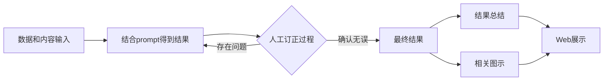

# 张桐林__Assignment #1

### Thoughts

以下全部内容都基于**GPT-4** 已经达到（或马上可以达到，包括官方/民间使用其API的一些project/plugins）的能力。

#### 1. 如何通过简单的信息流搭建，在一个新兴领域让相关的人主动来找我们？

> 首先，我认为“简单”的信息流（暗示搭建的成本低、门槛低等）与对用户的高吸引力（爆火或者实现长期稳定用户关注度）两者之间是鱼和熊掌不可兼得。因此如果要实现较好的获客，必须能够充分的满足潜在用户的需求（然而在当前这种信息爆炸的时代，用户越来越挑剔，口味越来越高），换言之**必须有高质量的内容输出，并且辅之良好的推销手段**，才有可能实现。
> 
> 1. **针对高质量的内容输出**：首先内容必须满足通俗和专业的两者平衡，既不能过于简单的泛化（客户会觉得质量低下），也不能过于艰深复杂（获客难度高）。
> 
> 2. **针对良好的宣传手段**：互联网时代下，输出的包装形式非常重要，如果是APP、Web则要有精良的UI/UX（美工和体验都要好）；如果是文章（类似于公众号推文等），则要有良好的排版（如果有公式、数据表格、图片等要保证清晰），适当的长度；如果是短视频（如抖音、快手（个人比较反对）、bilibili（比较推荐））形式，则需要精美的视频制作（包括炫酷的内容呈现）/良好的文案/颜值较高的讲解人等。
> 
> **以下主要是关于“宣传/形式”方面的讨论。**
> 
> 关于对客户群体的看法：
> 
> 1. 包括但不限于年轻人（比较常用互联网的、具有一定互联网思维和使用习惯的）要求很高，对于内容比较挑剔，他们的关注点包括但不限于：IP本身的咖位、行为和内容的政治正确、内容既要有道德高度但也不能太装、内容如果涉及到一些专业领域那么会关注内容的严谨性科学性。
> 
> 关于宣传方面的个人看法：
> 
> 1. 在推销方面，**比较推荐的平台**有：知乎、bilibili、微信公众号、YouTube；比较不推荐的平台有：小红书；比较反对的：抖音、快手用户群体整体素质较低下的平台等。
> 
> 2. **比较推荐的形式**有：知识分享—>知识付费/付费服务...。从我个人的观察来看，那些从0开始的且之后有稳定的用户群体的IP，通常可以从知识分享开始，比如知乎大V，b站做知识分享的大V，（如我自己关注的几个：码农高天、稚晖君、3blue1brown、跟着李沐学AI、...），这种的好处是，客户群体比较稳定，通过知识分享可以增强客户对于IP的信任，如果IP要提供付费服务，有需求的客户容易选择其进行消费。
> 
> 3. 这些**IP的共同之处是**：对于自己做的领域有深刻的认识和独特的见解、可以用通俗易懂的语言讲述、内容难度适中（对于这个领域各个水平的群体都有吸引力——换言之，既有干货也有湿货，让无论是新手还是高手都能津津有味）、视频制作精良（尤其是3blue1brown）
> 
> 4. **一个反例**：b站千万粉丝up——“老师好我叫何同学”，他在前期做过一些很炫酷很互联网的视频，如“5G体验、对Apple生态的体验等），由于他非常认真且用心做这些视频，视频炫酷，内容有趣，因此爆火；但是爆火后由于产出质量下降（主要被诟病为：有钱了但是水视频），现在网络上对他的争议很大。
> 
> 5. **一个样例**：b站百万粉丝up——稚晖君，是一个专做智能硬件和机器人的up。他的视频内容极为硬核，和他自己的超强的能力离不开（专业性），同时也非常认真的做产品（用心且认真对待产品和用户），因此他的视频内容质量也很高，粉丝很买账。（我反正每期视频都会看，如果他开始卖一些产品，我也愿意买）

#### 2. 如何借助AGI的智能整合信息持续为某领域提供领先的洞见？

> **这部分我认为主要考虑的是“内容”问题。**
> 
> 明确一下这个工作流程：
> 
>   **确定主题—>将prompt/data/materials输入gpt/其他AI—>输出—>修订—>结果**
> 
> 必须要指明的是，在GPT(>=GPT-4)时代，一般的大语言模型的使用成本已经很低了，门槛也并不高。除非可以获得有门槛的API（其他模型、支持更长的token等），**否则在模型这块并没有优势（任何人都没有优势）**，这意味着如果大家都拿着类似的materials最后输出出来的东西区别不会太大。那么我们的优势只能是：（1）独家数据。（2）基于独家分析角度的展开的prompt。
> 
> 1. 独家数据。这里的数据除了一些“数字”型的数据，也包括一些文本数据、图像数据、音频数据等等。*题外话：这里有点像有些量化私募，他们会找一些做NLP/CV的人做一项工作叫“另类数据“（区别于传统的价格数据、财务数据等）研究，比如通过研究卫星图像判断一家制造公司的订单出货情况，通过文本数据判断一家公司的财务状况和舆情等等。* 在这种情况下，数据是及其重要的，它直接决定了一篇分析报告的质量。以下是一些我认为可以得到独家数据的渠道：
>    
>    1. 来源于实地考察的一手数据，包括文件文本资料、图像、音频等。（这个没啥好说的）
>    
>    2. 通过爬取的数据，虽然能够爬取的数据理论上都是公开数据，但是由于数据爬取存在一定的门槛，而且大量数据存在难以进行分析的问题，如果可以做好互联网爬取，也可以建立起数据优势。（比如可以爬github、知乎、b站等等知识分享平台、也可以爬取Arxiv这种pre-print平台获取某些专业的论文资料，等等）。这种数据获取方式相当于“站在别人的肩膀上”，只要互联网上有其他人关注到了某个领域的某个点，我们就可以收集到它。
>    
>    3. 用户的feedback数据。除了一些直接的反馈的信息（如直接的反馈意见），通过建立社群，获取到的用户的聊天数据也是非常宝贵的信息。通常这种数据可以更及时的反应出用户的关注点、对于平台的建议/意见。而且可以通过对其进行综合的、整体的分析，也会有些意想不到的效果。*题外话：一些炒股群比较活跃的时候通常是市场行情比较好的时候，而比较冷清的时候通常是市场比较萧条的时候；但是如果在群活跃的时候入场，之后常常马上下跌；在群冷清的时候离场，之后可能马上就要大牛市了。。是一个很奇怪但是也很有趣的现象。*
> 
> 2. 独家分析的Prompt engineer。
>    GPT能力确实强大，然而，包括GPT-4在内的模型的逻辑性和专业性依然较差，因此必须使用prompt engineer。prompt engineer目前在国内还不是很火，会用的人并不太多，毕竟相比于chat-gpt这种傻瓜式的使用方式，需要写代码门槛还是高了不少。但是一些民间的组织目前基于prompt engineer正在快速的迭代封装程度很高的产品，Auto-GPT是一个里程碑式的产品。

#### Part-1 Demo

在此我想要实现的一个demo中应该实现如下的功能：

1. 输入一些源于互联网的文本资料，通过GPT-3.5进行内容分析
2. 对内容分析后，总结出一些关键内容、关键词、标语
3. 确定一些关键词和标语后，使用stable diffusion绘制一些相关的、炫酷的图
4. 用合适的排版，对得到的文本和图像进行展示，输出一个Web文件。

流程图:

**Note:** 由于我目前只有GPT-3.5-turbo的API，受token数量以及模型能力的限制，展示的流程无法通过逻辑链的方式实现自动化，大部分内容仍然需要基于手动操作和实现。

#### 以下是一个实际的demo开发过程:

1. 人工确定主题和关键词：关于AGI领域的，我这里选取的主题是关于“最新的大语言模型”。

2. 使用GPT-4 Web Browsing(Beta)进行搜索。
   
   > **User:** Now you are an industry analyst. Please search for the most current and authoritative information on Big Language Models and list the details or links.
   > **Respone:**
   > Claude is a large language model developed by Anthropic. One of its unique features is an expanded context window of up to 100K tokens, corresponding to around 75,000 words. This allows the model to analyze and digest large amounts of text very quickly. For instance, it was shown to read and understand the entire text of The Great Gatsby (around 72K tokens) in less than a minute【https://www.anthropic.com/index/100k-context-windows 】.
   > This expanded context window has a wide range of applications. Businesses can submit hundreds of pages of materials for Claude to process, and it can handle conversations that last for hours or even days【19†source】. Claude can retrieve information from multiple documents or a book and synthesize knowledge across many parts of the text. This capability reportedly works substantially better for complex questions than vector search-based approaches【https://www.anthropic.com/index/100k-context-windows 】.
   > With a 100K token context window, Claude can:
   > 
   > - Digest, summarize, and explain dense documents like financial statements or research papers
   > - Analyze strategic risks and opportunities for a company based on its annual reports
   > - Assess the pros and cons of a piece of legislation
   > - Identify risks, themes, and different forms of argument across legal documents
   > - Read through hundreds of pages of developer documentation and surface answers to technical questions
   > - Rapidly prototype by dropping an entire codebase into the context and intelligently build on or modify it【https://www.anthropic.com/index/100k-context-windows 】.
   > 
   > Regarding the number of parameters, the exact figure is not specified by Anthropic. However, a recent scientific paper suggests an order of magnitude of 175 billion parameters, which is on par with models like GPT-3 and GPT-3.5【https://the-decoder.com/anthropic-introduces-claude-an-ai-assistant-trained-by-an-ai/ 】.
   > Unfortunately, I was unable to find information on the technical implementation of Claude, whether it is open source, and how it compares to other large language models due to difficulties accessing some of the primary sources. I recommend trying a direct search on a reliable search engine or checking the official website of Anthropic for this information.

3. OK, GPT-4的这段文本信息是比较准确的，不需要多余加工，我们直接进入下一步环节。
   
   > **User:** Okay, based on the information you've got, if we're going to write a news article, please pick a few headlines that will attract readers, and then write a brief and concise summary.
   > **Respone:** 
   > Headlines:
   > 
   > 1. "Claude: The AI Revolutionizing Language Understanding with 100K Token Context Windows"
   > 2. "Anthropic Unveils Claude: A 175-Billion Parameter AI That Reads and Understands Texts Faster Than Ever"
   > 3. "Claude: The AI That Can Digest Hundreds of Pages in Minutes"
   > 4. "Claude: Analyzing Legal Documents and Prototyping Codebases – The New AI Powerhouse by Anthropic"
   > 5. "Making Sense of Massive Texts: Claude AI's 75,000 Word Reading Capability"
   > 
   > Summary:
   > Anthropic's latest AI offering, Claude, is making waves with its remarkable ability to understand and analyze large amounts of text. With a context window of 100K tokens or approximately 75,000 words, Claude can process hundreds of pages in just minutes. It can digest and summarize dense documents, analyze strategic risks from annual reports, assess legislation, identify themes across legal documents, and even intelligently build on a dropped codebase. With an estimated 175 billion parameters, Claude is a major player in the AI landscape, comparable to the likes of GPT-3 and GPT-3.5. Its unique capabilities promise to revolutionize how businesses and individuals interact with large volumes of text.

4. 按照如上的方式分别生成其他几个model的说明。

5. 使用Midjourney绘制一些图形，作为内容的补充。

6. 使用vue创建一个web项目，在gpt-3的配合下把首页搓出来，将文本和图像放到相关的位置。
   
   以上即完成一个web-demo的开发，并且尽可能的使用到AGI模型。（不过由于我只有gpt-3.5的api以及25条/3h受限制的GPT-4，人工操作仍然占据很大部分工作量）
